# Grange Equestrian

 

## The equestrian centre to book a horse riding lesson

Grange Equestrian was developed to allow beginners, intermediate and advanced riders to be able to book a riding lesson with an instructor of choice. The user can enter the site or app, read about the different types of lessons, read about the instructors and then book a lesson that is available. The site is intended to give the user all the information that they would need to enable them to make an informed choice of which lesson and which instructor they need to book. The booking process shows days available and timeslots within those days for the user to book. Once booked the user is shown exactly what they have booked which awaits approval by the instructor. 

The site also allows the user to view all comments made by other users who have had a that specific lesson. If the user has had a lesson they can then leave a comment on that specific lesson. The users can also delete a comment or edit a comment that they have left on the lesson.

### Project Overview

The Grange Equestrian site is intended to offer a user-friendly interface to allow the users to browse, review, learn and book a riding lesson.The project is designed to show the use of the latest web technologies and follows best practices in web development. The project follows the core structure of the Code Institute Blog walkthrough with the use of django and deploying to heroku and the setting up of the project. The project implements a date, timeslot and booking system to enable users to book a lesson. It also gives the user front end crud capability by allowing them to create, read, update and delete comments.

[Grange Equestrian Live Demo](https://castlelost-stud-cbac18c58c5b.herokuapp.com/)

### Key Features

- Booking capability
- Responsive design for various devices
- Ability to leave comments on lesson
- CRUD capability for user
- CRUD capability for Admin
- Ability for admin to add lessons and instructors through backend
- User authentication and profile management

### Target Audience

The site is designed for anybody interested in horse riding. This includes beginners, intermediate and advanced riders. 

## Table of Contents

1. [Features](#features)
    - [Key Features Summary](#key-features-summary)

2. [User Experience (UX)](#user-experience-ux)
    - [User Stories](#user-stories)
    - [Design Choices](#design-choices)
    - [Wireframes](#wireframes)

3. [Information Architecture](#information-architecture)
    - [Sitemap](#sitemap)
    - [ERD Diagram](#erd-diagram)
    
4. [Technologies Used](#technologies-used)
    - [Languages](#languages)
    - [Frameworks](#frameworks)
    - [Databases](#databases)

5. [Agile Methodology](#agile-methodology)

6. [Deployment](#deployment)

7. [Testing](#testing)

8. [Bugs and Fixes](#bugs-and-fixes)

9. [Unsolved Issues and Bugs](#unsolved-issues-and-bugs)

10. [Credits](#credits)

## Features

### Key Features Summary

    - Home page with book a lesson button
    - User registration and login with form validation and error handling
    - Django admin panel for superuser to manage, users, bookings, instructors and lessons
    - Customised 404 error pages
    - Booking capability for date and time slots
    - Ability to comment on a lesson
    - Full front and back end CRUD capability
    - Ability to view lesson comments
    - Lesson types dynamically served from the backend
    - Detailed explanation for each lesson type
    - Contact us capability for the user
    - select an instructor

## User Experience (UX)

### Project Goals

#### Site Owner Goals

The site owner goals was to allow a user to visit the site, easily be able to navigate around the site, to be able to easily and logically review lessons available, get details about the lessons and then to be able to book a lesson with a date and an available timeslot. The site owner goals was also for the use to understand that they had to be registered to enable them to book a lesson and to do this they had to be able to register easily. Once registered the user would easily be able to login to the site and from there logically and easily book a lesson. The site owner also wanted the User to know which lesson, the date and timeslot that they had just booked. 

#### User Goals

The user goals were to be able to easily book a lesson. The user wants to easily know how to book a lesson, and to have the ability to select and avalable date and within that date to be able to select an available timeslot. The user wants to be able to easily know if a timeslot is not available and not have the ability to book this date or timeslot. The user wants to also be told what they have actually booked. The user wants to be able to navigate logically and easily around the site and always have the ability to return to the home page. The user can also select an instructor.

### User Stories
User stories were used to drive this project. 
[User Stories (github issues)](https://github.com/Declan444/Castlelost-Stud/issues)
 
Kanban Board was used to control the project flow.
[Kanban Board (github project)](https://github.com/users/Declan444/projects/11)

### Landing Page
As a user I want to be able to visit the home page so that I can see a nav bar, header, main area and footer

#### Acceptance Criteria
    - The user can visit the landing page.
    - The user can see a navigation panel, header, main area and footer.
    - The user can see and usderstand easily the prupose of the site/app.

### Lessons Page
As a user I want to be able to click on the lessons link in the nav bar so that I can see the lessons offered by Grange Equestrian.

#### Acceptance Criteria
    - As a user I want to be able to click on the lessons link and be brought to a list of lessons.
    - As a user I want the lessons page to be full of information about the different lessons offered.
    - As a user I want the lessons page to be in the same style as the rest of the site.
    - As a user I want to be able to click on a lesson to give me detailed information about that lesson.

### Lesson Details Page Comments Area
As a user I want to be able to see user comments, create my own and carry out CRUD so that I can get a feeling of other peoples experiences have been after a lesson and leave my own comments.

#### Acceptance Criteria
    - As a user I want to be able to see all comments left by other users.
    - As a user I want to be able to carry out CRUD on my own lesson re comments.

### Lesson Details Page
As a user I want to be able to click on the lesson type so that I can get more detailed information about that specific lesson.

#### Acceptance Criteria
    -  As a user I can click on a lesson type to bring me to the details page.
    -  As a user I can read more detailed information about that specific lesson.

### Instructor Page
As a user I want to be able to click on the instructor page so that I can learn more about the instructors.

#### Acceptance Criteria
    - As a user I want to see an instructor link in the nav bar.
    - As a user, when I click on the instructor link it bring me to a detailed instructor page.
    - As a user I can see all the information about each of the instructors available.

### Create Lesson Types
As a admin I want to be able to create lesson types so that I can these are available for the user to select.

#### Acceptance Criteria
    - Create different lesson types in the admin section which are displayed on the lessons page.
    - Create lesson name, excerpt, and detailed information about the lesson.

### Select Lesson Type
As a user I want to be able to select from a number of lesson types so that I can select the lesson that best suits my level of riding.

#### Acceptance Criteria
    - When booking a lesson I can select the level that matches my abilities.
    - When booking a lesson I can select the Instructor.

### Register
As a user I want to be able to register so that I can become a registered user.

#### Acceptance Criteria
    - I want to be able to register with the site.
    - Once registered I want to be able to login.
    - Once registered I want to be able to logout.

### Contact Us Page
As a user I want to be able to leave a message so that I can get information from the site.

#### Acceptance Criteria
    - As a user I want to be able to click a contact us page when I am not registered.
    - As a user I want to be able to submit my information and leave a message.
    - As a use I want to be able to get a message to say that my message has been received.

### Booking Confirmation
As a user I want to be able to get confirmation of a booked lesson so that I can know that the lesson has been booked pending approval.

#### Acceptance Criteria
    - As a user I want to be able to book a lesson and be notified that the lesson has been booked with a modal message.
    - As a use I want to be able to see that the lesson timeslot is no longer available after I have booked that timeslot.

### Design Choices
#### Colour Scheme
The colour scheme is 
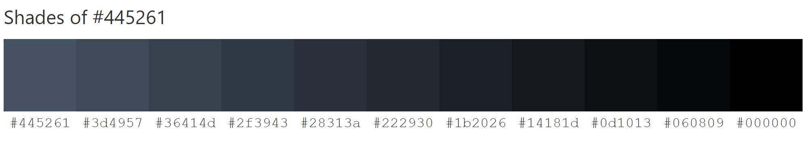

#### Typography
For this project I choose Roboto as is modern and suited my concept.

#### Imagery
All imagery is the property of Grange Equestrian and shows, horses and showjumping which depicts the theme of the site.

### Wireframes

Home Page

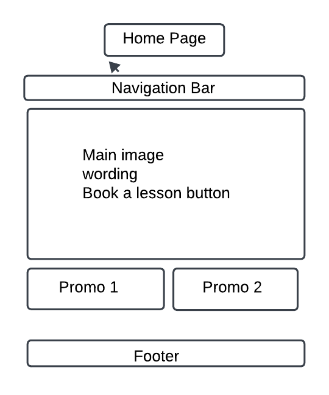

Lessons Page

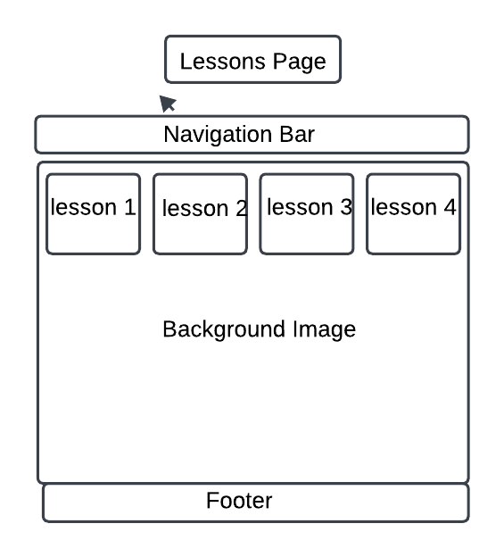

Lesson Detail Page

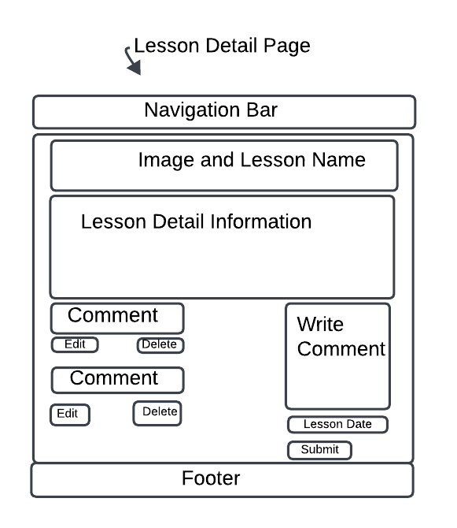

Instructors Page

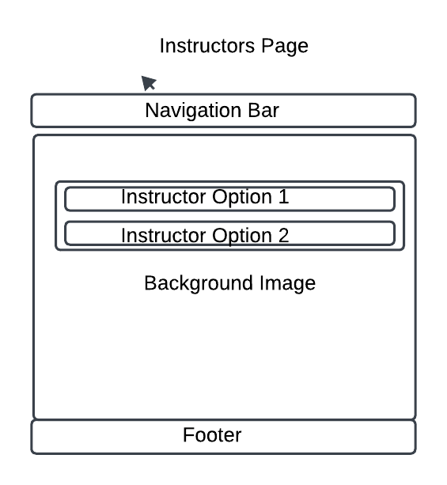

Book A Lesson Page

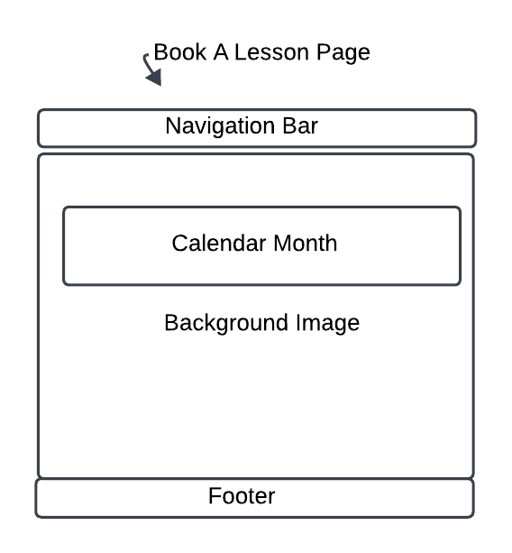

Available TimeSlots Page

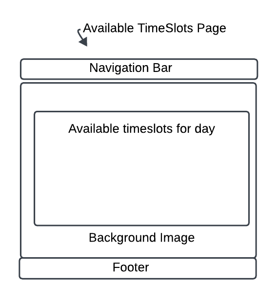

Booking Form Page

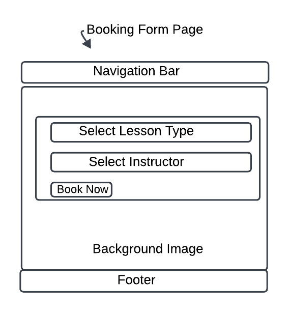

## Information Architecture
### Sitemap

The following sitemap gives a visual flow of the Grange Equestrian Site.

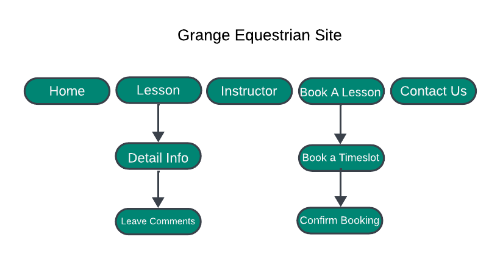

### ERD Diagram

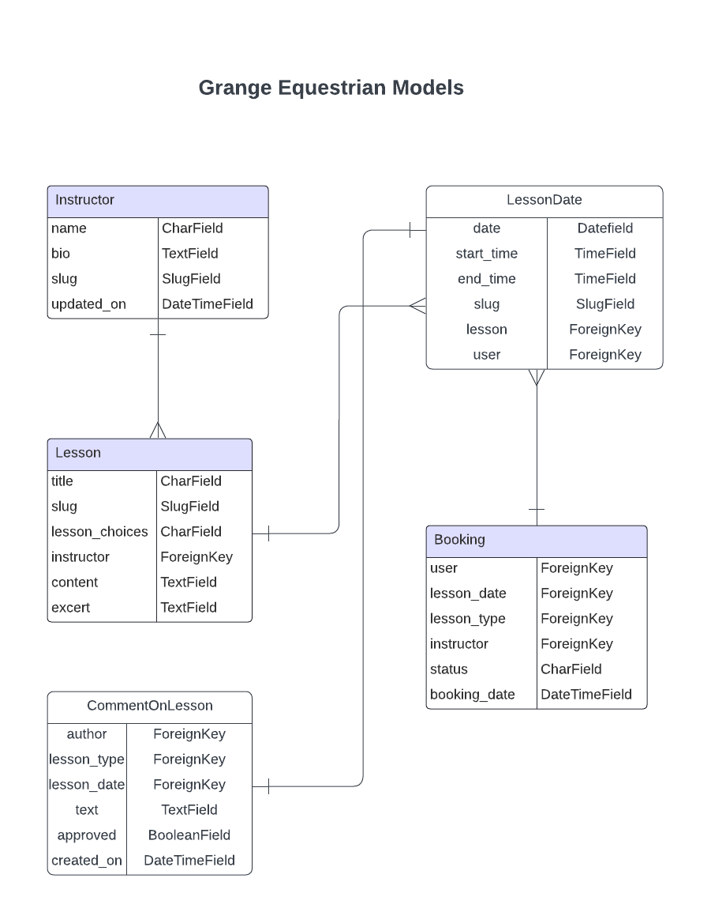

### Database Relationships

#### Instructor to Lesson: One to Many.
The instructor can have many lessons but a lesson can only have one instructor.  
The Instructor model has a foreign key in the Lesson model. The related_name='lesson_types' allows reverse access from Instructor to all associated Lesson instances.

#### Lesson to LessonDate: One to Many.
A lesson can have many different lesson dates but each lessson date can only be associated with one lesson. 
The LessonDate model has a foreign key pointing to the Lesson model, meaning each LessonDate is tied to a specific Lesson. The related_name='lesson_dates' allows reverse access from a Lesson to its associated LessonDate instances.

#### LessonDate to User (via booked_lesson_dates): Many to One.
A user can book many lesson dates but a specific LessonDate is booked by only one user. 
This links the LessonDate to the User who has booked that specific lesson date. The reverse relationship is provided by related_name='booked_lesson_dates'.

#### LessonDate to Booking: Many to One.
A booking refers to a specific Lesson, but a Lesson can be part of multiple bookings. 
The Booking model has a foreign key to Lesson, representing which lesson is being booked.

#### Instructor to Booking: Many to One.
A booking refers to a specific instructor, but an instructor can have many bookings.

#### LessonDate to CommentOnLesson: One to Many.
A single comment can only be made on one lesson, but a lesson can have many comments. 
The CommentOnLesson model is connected to the Lesson model with a foreign key, meaning a comment belongs to a specific Lesson. The related_name='comments' allows reverse access from the Lesson model to its associated comments.

#### LessonDate - CommentOnLesson: Many to One.
A LessonDate can have many comments, but each comment is linked to a specific LessonDate.

#### User to CommentOnLesson: Many to One.
 A User can write many comments, but each comment is written by one user. 
 The CommentOnLesson model links to the User model via the author field, indicating which user authored the comment.

[Go to Table of Contents](#table-of-contents)

## Technologies Used
### Languages
    - HTML
    - CSS
    - Javascript
    - Python

### Frameworks & Libraries
    - Django 4.2.14
    - Bootstrap 5.0.1
    - Cloudinary 1.36.0
    - dj3-cloudinary-storage 0.0.6
    - Gunicorn 20.1.0
    - Whitenoise 5.3.0

See requirements.txt for full list.

### Databases
- SQLite (development)
-CI PostgreSQL (production)

## Agile Methodology

Used the agile approch as outlined in the Code Institute learning material with the development of a Kanban Board, user stories, tasks, aceptance criteria etc. 
It allowed me to be able to:
    - Respond quickly to changes 
    - Deliver working features incrementally
    - Maintain a clear overview of project progress for review when I returned to the project
    

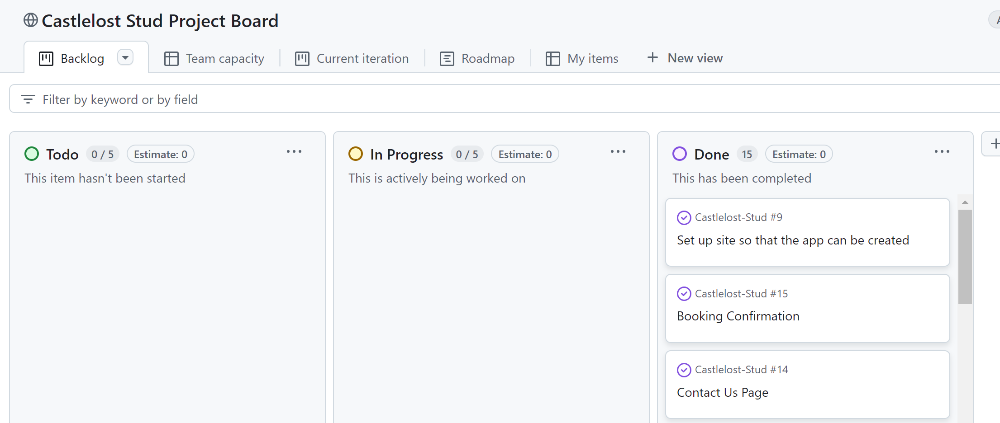

## Deployment 

This website is deployed to Heroku from a GitHub repository, the following steps were taken:

## Creating Repository on Github

    - First make sure you are signed into Github and go to the code institutes template.
    - Then click on use this template and select Create a new repository from the drop-down. Enter the name for the repository and click Create repository from template.
    - Once the repository was created, I clicked the green gitpod button to create a workspace in gitpod so that I could write the code for the site.

## Creating an app on Heroku

- After creating the repository on GitHub, head over to [Heroku](https://www.heroku.com) and sign in.  
- On the home page, click New and Create new app from the drop down.
- Give the app a name(this must be unique) and select a region I chose Europe as I am in Europe, Then click Create app.

## Create a database

- Login to [Cldatabase maker](https://dbs.ci-dbs.net/)
- add hour email address in the input field and submit the form
- open database link in your email
- past database URL in your DATABASE_URL variable in env.py file and in Heroku config vars

## Deploying to Heroku

- Head back over to [Heroku](https://www.heroku.com) and click on your app and then go to the Settings tab
- On the settings page scroll down to the config vars section and enter the DATABASE_URL which you will set equal to the elephantSQL URL, create Secret key this can be anything,  CLOUDINARY_URL this will be set to your cloudinary url and finally Port which will be set to 8000.
- Then scroll to the top and go to the deploy tab and go down to the Deployment method section and select Github and then sign into your account.
- Below that in the search for a repository to connect to search box enter the name of your repository that you created on GitHub and click connect
- Once it has been connected scroll down to the Manual Deploy and click Deploy branch when it has deployed you will see a view app button below and this will bring you to your newly deployed app.
- Please note that when deploying manually you will have to deploy after each change you make to your repository.

## Testing